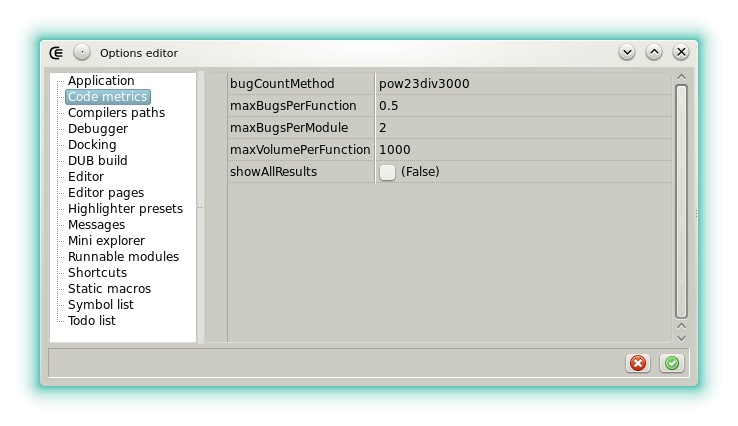

### Code metrics

The quality of the D code is verifiable using code metrics.
In general several metrics exist:

* simple Source Line of Code (SLOC), white lines and comment counter.
* [Halstead complexity](https://en.wikipedia.org/wiki/Halstead_complexity_measures): quality indicator based on the count of operators and operands.
* [Cyclomatic complexity](https://en.wikipedia.org/wiki/Cyclomatic_complexity): quality indicator based on the program execution flow.

Coedit implements the Halstead metric. The others may be added in a further version.

#### Halstead complexity

The metric uses the count and the sum of the functions operands and operators to compute several indexes. Even it's clearly related to the SLOC it's more accurate. For example:

```d
void foo() 
{
    int a = 1, b;
    a = a + a;
}
```

Is seen as less complex than

```d
void foo() 
{
    int a = 1, b;
    a = a + b++;
}
```

even if the SLOC count is the same.

The verification is launched from the _File_ menu, _View Halstead metrics_.
Each free function and member function of the module that has the focus is measured.
When thresholds are crossed warnings are emitted. There is 3 possible warnings:

* the maximal estimated number of bugs per function is reached, by default 0.5.
* the maximal estimated number of bugs per module is reached, by default 2.
* the maximal volume of a function is reached, by default 2000.

Warnings are informative. They should simply be interpreted as an indicator that a function must be more tested or refactorized.

It's important to note the limits of the measure:

* even with D embedded unit tests, the measure is not able to detect that a complex function is well tested.
* the evolution of the quality over the time is not followed-up.
* results are only relevant with the _imperative_ and _object oriented_ programming paradigm. Template Meta Programming will give wrong results. UFCS chain are not detected as consecutive calls.

Default values can be modified in the option editor:



The maximal volume of a module is not verified, simply because it's possible to have huge modules with many small functions of high quality.