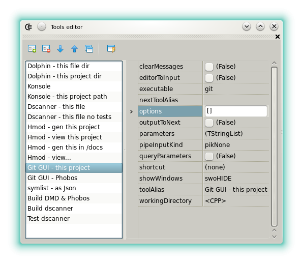



### Custom tools

This widget allows to define a set of third party applications that can be launched from Coedit.
The tools are not just applications that are launched from the software.
Since they support [symbolic strings](features_symbolic_strings) they can directly perform some actions on the current source file, in its directory, in the project directory and more.
The tools can even be chained and piped between themselves.

A few examples:

- launch a console with its working directory set to the project file directory.
- generate the documentation for all the project sources.
- launch a custom build tool.
- launch git gui directly on the current project.

Toolbar:

- : Adds a new tool.
- : Removes selected tool.
-  **/** : Changes the position of the selected tool.
- : Executes the tool that's selected, according to the options it's associated to. This also works by double-clicking the tool aliases.
- : Clones the tool that's selected.

A tool can be selected from the left side of the widget. If selected, a property inspector displays the options that can be edited:

- **clearMessages**: If the tool standard output is redirected to the [messages widget](widgets_messages) then the previous messages are cleared before the execution. The output is redirected to the messages when **popUsePipes** is set and if **nextToolAlias** is empty.
- **editorToInput**: Deprecated, see **pipeInputKind**.
- **executable**: The tool file name. If the system cannot find its path in the environment variables then it must be included. The field can include [symbolic strings](features_symbolic_strings).
- **nextToolAlias**: Defines the alias of another tool that will be launched after this one returns.
- **options**: Various options for the process to create. If you set **poUsesPipes** and **poStdErrToOutput** to true, then the standard output will be redirected to the message widget, category Misc.
- **outputToNext**: If **popUsePipes** is set in the options and if the next tool is defined then the next tool will see its input stream filled with the output stream.
- **parameters**: Defines the parameters, switches and options passed to the process. As usual, one item per line, no quotes. The items can contains [symbolic strings](features_symbolic_strings). The parameters can contain a special symbol, `<$1>`, which expands to the string passed to the dialog when **queryParameters** is checked.
- **pipeInputKind**: Defines what will be piped to the tool standard input after it's been launched (editor content, current line or selection).
- **queryParameters**: If checked then an input query dialog will be shown before executing the tool. It can be filled with more _--para --meters_.
- **shortcut**: Defines the keystroke used to launch the tool. The shortcut can also be edited in the [options editor](widgets_options_editor).
- **showWindow**: Defines how the tool window is displayed. Set to **swoHIDE** if the tool standard output is redirected.
- **toolAlias**: The friendly name associated to the tool.
- **workingDirectory**: The directory in which the tool starts. Not to mismatch with its path. The field can contain [symbolic strings](features_symbolic_strings).