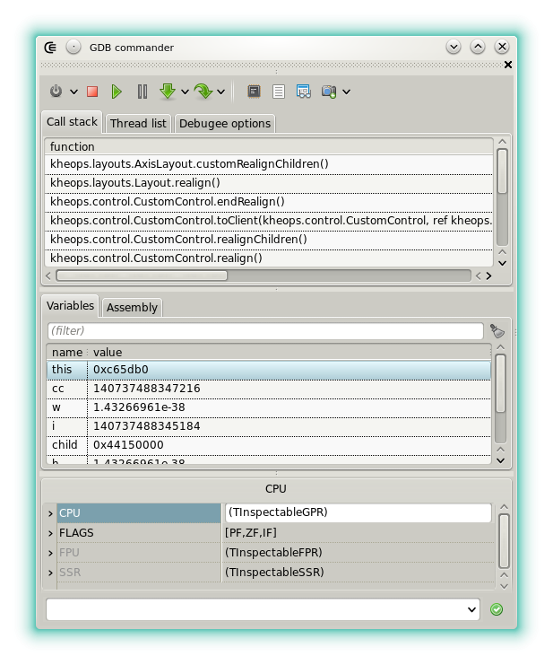



### GDB commander

GDB commander is a GUI front-end for the [GNU debugger](https://www.sourceware.org/gdb/). It's only available under Linux.

It allows to debug the project output (is it's an application) but also the [runnable modules](features_runnables).

#### Breakpoints

The breakpoints are handled by the editor. Click the gutter to add or to remove a breakpoint.
After a break, the following icons may be displayed in the gutter:

- : A breakpoint is reached.
- : A watch point is reached is reached. For now the only watchpoints that are supported those monitoring a variable (see the toolbar description).
- : The program execution stopped here for another reason. It may be caused by step by step execution or because of an unexpected signal has been received.

#### Target options

This page allows to edit the options passed to the debugger target (also called _the inferior_).

- **arguments**: Allows to set the target command line arguments. One item per line. Items can include [symbolic strings](features_symbolic_strings).
- **environmentPaths**: Allows to add additional folder for the PATH variable. One item per line.
- **queryArguments**: When checked and when the debugging cession starts a small input dialog is displayed. It can be used to pass more **--para --meters** to the target.
- **target**: Read-only. Indicates clearly which is the project or the runnable module that will be debugged.
- **workingDirectory**: Allows to set the target working directory. Can include [symbolic strings](features_symbolic_strings).

#### CPU inspector

This page shows the content of the CPU registers. Each value can be modified.
Note that for now SSE registers are not supported by the inspector.

#### Toolbar

- : Starts debugging. By default the project output is launched. It Should to be compiled with the debug info generation. A context menu at the right allows to debug the [runnable](features_runnables) binary produced for the editor that has the selection.
- : Stops the debugging cession.
- : Resume the debugging cession.
- : Pauses the debugging cession.
- : Steps to the next instruction, including inside functions. A context menu at the right allows to define if stepping is done at the source level (line by line) or at the hardware level (instruction by instruction).
- : Steps to the next instruction, excluding functions calls. A context menu at the right allows to define if stepping is done at the source level (line by line) or at the hardware level (instruction by instruction).
- : Updates the CPU inspector.
- : Updates the call stack list.
- : Updates the local variables list.
- : Allows to set or remove a watch point. When the button is clicked, a watch is added for the variable that's selected in the variables list. A context menu at the right allows to define the access for which the debugger breaks.

#### Custom commands

The field at the bottom allows to pass custom commands to GDB.
A custom command can include a [symbol string](features_symbolic_strings).

You may pass command with the standard CLI syntax, however since GDB is launched with the option that activates the machine interface (MI) the standard commands are not guaranteed to succeed.
The option _showRawMIOutput__ must be activated in order to get GDB the answer to a custom command in the [messages](widgets_messages).

Learn more about the commands and the MI syntax in [the official manual](http://sourceware.org/gdb/current/onlinedocs/gdb/).

Example of useful commands:

- **-stack-list-variables --skip-unavailable --all-values**: prints a more complete list of variable that the default one. Can be used to set a watchpoint on a variable that's not listed by default.
- **-data-list-register-values xmm0 d**: prints the value of XMM0 as a decimal number. For now the CPU inspector doesn't display the SSE registers so this is the only way to inspect them.

It's also possible to add breaks for libraries load and unload. Each possible break reason that GDB can output is interpreted by the widget.

#### Target input stream

The field at the bottom is also used to pass input to the target standard input. 
To differentiate a custom command from an input line, use the `>` (greater than) symbol. The text following the symbol is written to the input stream, with an implicit new line character.

#### Options

- **asmSyntax**: Sets the assembler syntax used in the _Assembly_ tab. Intel or AT&T.
- **autoDemangle**: Sets if the GDB output is automatically filtered by [ddemangle](). Useful in the _Call stack_ tab.
- **autoDisassemble**: Sets if the assembly output is automatically retrieved when the execution breaks.
- **autoGetCallStack**: Sets if the call stack is automatically retrieved when the execution breaks.
- **autoGetRegisters**: Sets if the CPU view is automatically retrieved when the execution breaks.
- **autoGetThreads**: Sets if the thread list is automatically retrieved when the execution breaks.
- **autoGetVariables**: Sets if the list of the local variables is automatically retrieved when the execution breaks.
- **commandHistory**: Container that stores the custom GDB commands.
- **ignoredSignals**: Sets the signal that won't break the execution.
- **keepRedirectedStream**: Sets if the files that contain the inferior I/O history are kept on the disk. These files stands in the target directory and are named _.inferiorin_ and _.inferiorout_.
- **shortcuts**: Allows to define a shortcut for each button in the toolbar.
- **showGdbOutput**: For debugging the widget. When checked the raw GDB output (before being interpreted) is displayed in [the messages](widgets_messages).
- **showOutput: Displays the target output in [the messages](widgets_messages). May be deactivated for a GUI program.
- **showRawMIOutput**: For debugging the widget. When checked the GDB output (after JSON-ization) is displayed in [the messages](widgets_messages).
- **stopAllThreadOnBreak: Sets if all the target threads are stopped when the execution breaks. Not applied until next debugging cession.
